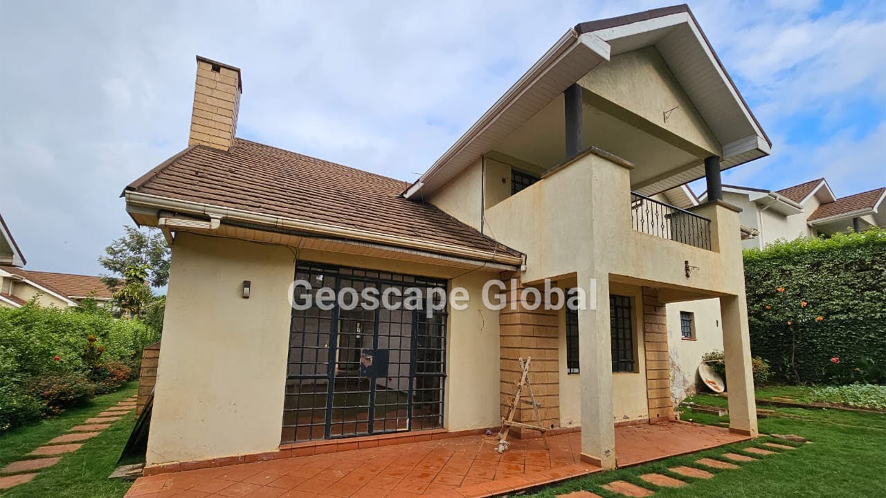


<!-- Drop this anywhere in your README.md or page HTML -->



  
  
  

# A
## Kitisuru Ridge (Kitisuru, Nairobi)

Here’s a geological sketch of what’s going on (or likely going on) at Kitisuru Ridge in Nairobi — note: because I couldn’t locate a detailed published study *specifically* for Kitisuru Ridge, this is a synthesis of what is known for the broader Nairobi area, applied to the ridge. Treat it as informed hypotheses rather than fully established fact.

---

### 1. Context: geology of the Nairobi region

* The Nairobi area lies on the eastern flank of the East African Rift System — this means the region has experienced significant volcanic and tectonic activity. ([erepository.uonbi.ac.ke][1])
* The bedrock in and around Nairobi comprises a thick succession of **alkaline volcanic rocks** (lavas and tuffs) accumulated from mid-Miocene into the Pleistocene. ([World Bank][2])
* Some of the main rock units encountered in the Nairobi region:

  * Nairobi Phonolite: dark grey porphyritic lava flows. ([collegesidekick.com][3])
  * Nairobi Trachyte: green-grey trachytic lava flows, sometimes with feldspar phenocrysts (large crystals) in a finer groundmass. ([Scribd][4])
  * Kerichwa Valley Tuff: pumice-rich volcanic tuffs and agglomerates overlaying older flows in places. ([AJOL][5])
* The presence of these volcanic rocks underpins the local soils (loams, somewhat fertile) and the topography (hills, ridges, slopes) in Kitisuru and environs. For example, an Environmental Impact Assessment for a development in Kitisuru notes:

  > “The soils of this area consist of Nairobi Trachytes and phonolitic.” 
* There have been tectonic influences: faults, fractures, general extension accompanying rift formation, which affect drainage, groundwater, slope behaviour, etc. ([erepository.uonbi.ac.ke][6])

---

### 2. What likely is happening at Kitisuru Ridge geologically

Based on the above, here are the components and dynamics at play for Kitisuru Ridge:

**a) The ridge is a volcanic-derived landform**

* The ridge terrain in Kitisuru likely reflects differential erosion and resistance: volcanic lavas (e.g., trachytes or phonolites) are more resistant, forming higher ground or ridge crests; softer materials (tuffs, sediments) erode more deeply, forming valleys/lowlands. This pattern is common around Nairobi.
* So when you see a “ridge” in Kitisuru, you're likely looking at a harder volcanic cap or flow unit that has held up while surrounding material eroded.

**b) Slope and hydrology implications**

* Because the ridge is elevated (for example, a survey in Kitisuru found elevations ~1721 m to ~1746 m above sea level). ([Orbital Africa][7])
* The soils and rock types (volcanic lavas) will influence water infiltration, slope stability and drainage. Hard lavas may have fractures, joints, vesicles; surface soils derived from lavas may be loamy but thin in places.
* The EIA document mentioned “heavy rains … steep slopes … surface run-off increased significantly” in the area. ([Orbital Africa][7])
* So in Kitisuru Ridge you’d expect good elevation, potentially steep slopes, and underlying rocks/structures that affect how water moves (both surface and groundwater).

**c) Engineering/geotechnical issues**

* For any development (which you as founder/CEO might care about), understanding the geology matters: what is the rock type, fracture pattern, slope stability, drainage. In Nairobi region, trachytes, phonolites and volcanic tuffs have been studied from engineering standpoint: some are strong, others weaker. ([erepository.uonbi.ac.ke][8])
* On slopes, if the upper rock unit is hard and underlying material softer, you might get slip planes, erosion amplification, etc. Also, drainage infrastructure must account for high runoff due to slope + volcanic rock permeability (or lack thereof).

---

### 3. Key take-aways for Kitisuru Ridge (for your context as founder/CEO)

* The ridge is likely underlain by volcanic lava flows (trachyte/phonolite) of Miocene-Pleistocene age, and local soils are volcanic in origin.
* Slope gradients may be relatively steep; heavy rainfall events (e.g., El Niño) can trigger damage via surface runoff or soil/rock movement (as noted in the 2023–24 rains in one topographic survey).
* For any plot development: check rock type, joints/fractures, groundwater flow, drainage. For example, water may infiltrate or flow through fractures in the volcanic rock, or run off quickly on impermeable rock, causing erosion.
* The geological substrate gives a strong foundation (hard volcanic rock) in many places, but local variation means you need a geotechnical site survey.
* Because the geology is volcanic, the topography is more rugged than flat plain; ridge height gives views (which is good for value) but also slope risk (which raises cost/engineering needs).

---

### 4. Limitations & what to check

* I did *not* find a published detailed geological map *specifically* for “Kitisuru Ridge” by that name, so my statements are based on regional geology of Nairobi and neighbouring terrains.
* Local variation matters: exactly which lava unit (which trachyte or phonolite), thickness, presence of faults/fractures, weathering—all differ from block to block.
* Given that you’re operating at LLC-scale (founder/CEO etc), you might want to commission a **site-specific geotechnical and geological survey** if developing land on the ridge (to check rock type, slope stability, drainage, etc).
* Also check risk of earth-movement (erosion, landslide) and proper drainage design given the steep slopes and volcanic substrate.

---

If you like, I can search for **geologic map layers** for Kitisuru/W. Nairobi (GIS data) and we can try to pinpoint the exact rock unit under the ridge you’re interested in. Would you like that?

[1]: https://erepository.uonbi.ac.ke/handle/11295/73742?utm_source=chatgpt.com "Volcanic Associations In The Gregory Rift Valley, East Africa"
[2]: https://documents1.worldbank.org/curated/en/645491510244366719/pdf/SFG1405-V21-EA-P107314-Box405309B-PUBLIC-Disclosed-11-9-2017.pdf?utm_source=chatgpt.com "SFG1405 V21"
[3]: https://www.collegesidekick.com/study-docs/16196980?utm_source=chatgpt.com "DMCH016_S2e_Nairobi.pdf - % % % % % % GEOLOGIC HISTORY Above: Map showing featured - College Sidekick"
[4]: https://www.scribd.com/document/496141218/Onyancha-Geological-and-geotechnical-conditions-of-Nairobi?utm_source=chatgpt.com "Onyancha - Geological and Geotechnical Conditions of Nairobi | PDF | Igneous Rock | Geotechnical Engineering"
[5]: https://www.ajol.info/index.php/ajst/article/download/55166/43638?utm_source=chatgpt.com "African Journal of Science and Technology (AJST)"
[6]: https://erepository.uonbi.ac.ke/handle/11295/9907?utm_source=chatgpt.com "Geological controls on groundwater distribution in nairobi county. kenya"
[7]: https://orbital.co.ke/procedure-for-topographical-survey-project-using-gnss-rtk-in-kitisuru-nairobi/?utm_source=chatgpt.com "Topographical survey project with GNSS RTK Kitisuru, Nairobi"
[8]: https://erepository.uonbi.ac.ke/handle/11295/44341?utm_source=chatgpt.com "Evaluation Of Volcanic Rocks Of Nairobi Area For Use As Raw Materials In The Construction And Cement Industry"

# B
# Compressed geological story — your calculus, turned into a tidy table

Nice — let’s turn that pipeline into a compact, semi-formal “translator” between your calculus operators and the geology of Kitisuru Ridge. I’ll map each step to a geological meaning, give a small symbolic simplification you can treat as a one-line hallucinated model, and finish with a tiny numeric toy to show how the pieces add up.

| Step (operator)                          |                                                                                 Plain mathematical meaning | Geological proxy / observable at Kitisuru Ridge                                                           | Compact symbolic simplification (hallucinated)                                        | Actionable implication                                                        |                                                                                           |
| ---------------------------------------- | ---------------------------------------------------------------------------------------------------------: | --------------------------------------------------------------------------------------------------------- | ------------------------------------------------------------------------------------- | ----------------------------------------------------------------------------- | ----------------------------------------------------------------------------------------- |
| **(E, x)**                               |                    E is the erosion / elevation state variable; x = location (on the ridge, slope, valley) | Rock type & resistance (trachyte/phonolite vs. tuff), slope angle, surface cover (soil, vegetation)       | `E(x)` = baseline elevation/erodibility map (function of lithology, slope)            | Map rock units & slope and assign `E0(x)` (initial condition)                 |                                                                                           |
| **E(t | x) + ε**                         |                                                Expected state at time t given location x plus random noise | Expected erosion or elevation at time t given rainfall history, land use; ε = weather/anthropogenic noise | `E(t                                                                                  | x) ≈ E0(x) + f_rain(t,x) + ε(t,x)`                                            | Use rainfall record + land-use to predict mean trend; quantify uncertainty band           |
| **dE_x/dt**                              |                                 Instantaneous rate of change (erosion rate; deposition rate negative sign) | Measured as mm/yr or m/yr: sheetwash, gullying, incision rate, soil loss                                  | `r(x,t) = dE/dt` — physical rate (m·yr⁻¹) driven by runoff intensity, slope, cohesion | Identify hotspots where `r` is high → slope remediation, drains, revegetation |                                                                                           |
| **d²E_x/dt²**                            |                                               Acceleration of erosion (how the erosion *rate* is changing) | Storm pulses, landslide initiation, rapid undercutting where underlying material weaker                   | `a(x,t) = d²E/dt²` — positive spike indicates destabilization (landslide risk)        | Rapidly rising `a` needs urgent mitigation (retaining walls, slope regrading) |                                                                                           |
| **∫ E_x dt + ε_x t + C_x**               | Cumulative integrated effect (total erosional loss/gain over time) plus linear drift and baseline constant | Long-term elevation loss, gully depth, cumulative sediment yield downstream                               | `S(x,T) = C_x + ε_x T + ∫_0^T E(t                                                     | x) dt` — net elevation change after time T                                    | Use for lifetime estimates (how much soil/rock lost in 5–30 yrs); design cut/fill volumes |
| **Compressed / hallucinated meta-model** |                                                  A single compact predictive form that stitches the pieces | A one-line emulator for ridge behaviour under typical storm+land-use                                      | `E(t                                                                                  | x) ≈ C_x + E0(x) + r0(x) t + ½ a(x) t² + ε_x t`                               | Quick scenario runs; gives first-order numbers for planning                               |

---

### Small symbolic derivation (keeps to your operators)

Assume locally we can expand the expected erosion as a low-order polynomial in time (a working hypothesis / hallucination):

[
E(t\mid x) = E_0(x) + r_0(x),t + \tfrac{1}{2} a(x),t^2
]

where
• (E_0(x)) = initial elevation (or baseline erodibility term)
• (r_0(x)=\left.\frac{dE}{dt}\right|_{t=0}) = initial erosion rate (m·yr⁻¹)
• (a(x)=\frac{d^2E}{dt^2}) = acceleration (m·yr⁻²)
Add stochastic drift/noise as your pipeline prescribes: (+\epsilon_x t) and constant (C_x).

Integrate from 0 to (T):

[
\int_0^T E(t\mid x),dt = E_0 T + \tfrac{1}{2} r_0 T^2 + \tfrac{1}{6} a T^3
]

So the cumulative model matching your last operator is

[
S(x,T)=C_x + \epsilon_x T + E_0 T + \tfrac{1}{2} r_0 T^2 + \tfrac{1}{6} a T^3 .
]

That expression is compact, interpretable, and easy to plug numbers into for scenario work.

---

### Tiny worked toy example (hallucinated numbers for intuition only)

Pick a patch on the ridge with:
• (E_0 = 0) (use elevation *change* baseline),
• initial erosion rate (r_0 = 0.10\ \text{m·yr}^{-1}) (10 cm/yr of net soil loss — plausible for exposed, gullied slopes),
• acceleration (a = 0.02\ \text{m·yr}^{-2}) (small positive acceleration during wetter years),
• noise/drift (\epsilon_x = 0.01\ \text{m·yr}^{-1}) (small stochastic drift),
• (C_x = 0).

Compute cumulative loss over (T=10) years:

1. (E_0 T = 0 \times 10 = 0) m.
2. (\tfrac{1}{2} r_0 T^2 = 0.5 \times 0.10 \times 100 = 0.5 \times 10 = 5.0) m.
3. (\tfrac{1}{6} a T^3 = \tfrac{1}{6} \times 0.02 \times 1000 = \tfrac{1}{6} \times 20 = 3.333) m.
4. (\epsilon_x T = 0.01 \times 10 = 0.10) m.

Sum: (S(x,10) \approx 0 + 0.10 + 5.0 + 3.333 = 8.433) m total of modeled elevation change (interpreted as cumulative erosional signature, remembering we hallucinated relatively large parameter choices to illustrate scale).

Interpretation: with those parameter choices, the model *predicts* a big cumulative change (many metres) over 10 years — which flags the patch as extremely unstable and in need of urgent intervention. If you make (r_0) and (a) smaller (say 0.01 and 0.002 respectively), the cumulative loss drops by more than an order of magnitude.

---

### Practical reading of the table & model (how to use it)

* Use geological mapping (lithology + slope) to set (E_0(x)) and plausible ranges for (r_0(x), a(x)).
* Calibrate (r_0) from short-term observations (erosion pins, repeated DGPS/topo surveys, drone photogrammetry).
* Reserve (a(x)) for non-stationary drivers (land-use change, climate shifts, urban runoff increases).
* Use the cumulative formula (S(x,T)) for cut/fill budgeting and for risk thresholds (e.g., >0.5 m loss in 5 years → remediation).
* Treat the whole thing as a compact emulator — fast, interpretable, but **not** a substitute for site geotech and continuous monitoring.

---

We’ve effectively “compressed” the geological story into a small set of parameters you can estimate in the field and then run scenarios with. The fun part: the hallucination is explicit — pick parameter ranges consistent with local trachyte/phonolite behaviour and rainfall intensity, then run the emulator to find danger zones and design interventions.

That’s the compressed engine. If you want, I can (a) convert this to a CSV/table you can open in Excel, (b) generate a small Monte Carlo ensemble of plausible `r0`/`a` values and give percentile outputs for `S(x,T)`, or (c) sketch simple field scripts for measuring `r0` and `a` in one weekend of work.

# C
Coming Soon..
